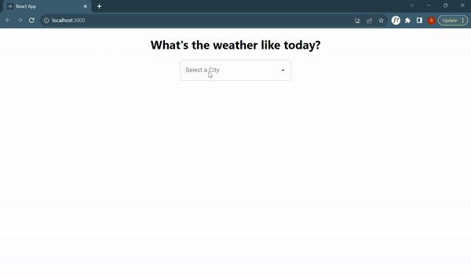

# Getting Started with Create React App

This project was bootstrapped with [Create React App](https://github.com/facebook/create-react-app).

## Weather App

In the project directory, you can run:

`npm start`

Runs the app in the development mode.\
Open [http://localhost:3000](http://localhost:3000) to view it in the browser.

### Question
Your application should allow the user to enter/select a City, and display its current weather report.  
Provide us a link to the source code on github for review. Bonus points if you can provide us the link to your application.

### Overview of the solution

